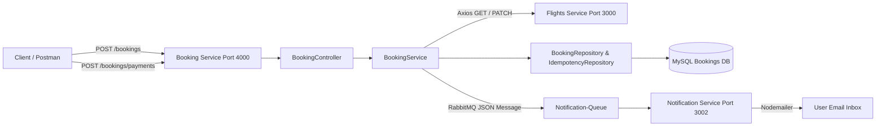

# Booking Microservice

This is the **Booking Service** microservice running on **Port 4000**, interacting synchronously with the **Flights Booking Service** (`http://localhost:3000`) via HTTP (`axios`) for inventory management, and asynchronously with the **Notification Service** (`http://localhost:3002`) via **RabbitMQ** (`Notification-Queue`) to trigger instant email confirmations.

## Architecture & Layering



## Features & Two-Phase Booking Flow

The booking and payment lifecycle is decoupled into two clean transactional phases:

### Phase 1: Booking Initiation (`POST /api/v1/bookings`)
1. **Idempotency Check**: Checks `x-idempotency-key` header or body `idempotencyKey`. If a booking was already created with this key, returns the cached result.
2. **Flight & Seat Validation**: Calls `GET http://localhost:3000/api/v1/flights/:flightId` via Axios to verify seat availability (`noOfSeats <= totalSeats`) and calculate `totalCost`.
3. **Database Transaction**: Starts a MySQL transaction (`INITIATED` status).
4. **Reserve Inventory**: Calls `PATCH http://localhost:3000/api/v1/flights/:flightId/seats` (`dec: true`) via Axios to deduct seats from the Flights Service.
5. **Response**: Returns the newly created booking details with `status: "initiated"`.

### Phase 2: Payment Confirmation (`POST /api/v1/bookings/payments`)
1. **Idempotency Verification**: Strictly requires `x-idempotency-key` header (or `idempotencyKey`). If missing, immediately rejects with HTTP `400 Bad Request`:
   ```json
   {
     "message": "idempotency key missing"
   }
   ```
2. **Transactional Validation**: Within a MySQL transaction, fetches the booking (`BookingRepository.get({ id: bookingId }, transaction)`).
   - Rejects if booking is `CANCELLED` (`The booking has expired or been cancelled`).
   - Rejects if `totalCost` doesn't match the required amount (`Amount of the payment doesnt match`).
   - Rejects if `userId` doesn't match the booking (`User corresponding to the booking doesnt match`).
   - If already `BOOKED`, safely returns the booking object (`idempotent behavior`).
3. **Status Update**: Updates booking status from `initiated` to `booked`. Stores the success response against the idempotency key and commits the MySQL transaction.
4. **Asynchronous Notification**: Publishes a JSON confirmation payload to RabbitMQ (`Notification-Queue`):
   ```json
   {
     "recepientEmail": "user@gmail.com",
     "subject": "Flight booked",
     "text": "Booking successfully done for the booking <bookingId>",
     "status": "booked"
   }
   ```
5. **Response**: Returns HTTP `200 OK` with:
   ```json
   {
     "success": true,
     "message": "Successfully completed the request",
     "data": {
       "id": 6,
       "flightId": 2,
       "userId": 1,
       "status": "booked",
       "noOfSeats": 5,
       "totalCost": 17500,
       "createdAt": "2026-07-09T20:11:10.000Z",
       "updatedAt": "2026-07-09T20:11:10.000Z"
     },
     "error": {}
   }
   ```

---

## API Endpoints Summary

| Method | Endpoint | Description | Required Headers / Body |
| :--- | :--- | :--- | :--- |
| `POST` | `/api/v1/bookings` | Initiate booking & reserve seats (`status: initiated`) | `flightId`, `userId`, `noOfSeats` (`x-idempotency-key` optional) |
| `POST` | `/api/v1/bookings/payments` | Confirm payment (`status: booked`) & send email | **Required Header**: `x-idempotency-key`<br>**Body**: `bookingId`, `userId`, `totalCost` |
| `GET` | `/api/v1/bookings/:id` | Fetch details of a specific booking | `id` parameter |

---

## Setup & Running Instructions

### 1. Environment Configuration (`.env`)
Create a `.env` file in the project root (`C:\Users\AKSHANSH RANJAN\Desktop\Code\Booking_Service\.env`):
```env
PORT=4000
DB_USER=root
DB_PASSWORD=your_mysql_password
DB_NAME=bookings_development
DB_HOST=127.0.0.1
FLIGHT_SERVICE_PATH=http://localhost:3000
RABBITMQ_URL=amqp://localhost
RABBITMQ_QUEUE_NAME=Notification-Queue
```

### 2. Database Migrations
```bash
npm install
npx sequelize db:create
npx sequelize db:migrate
```

### 3. Start Service
Ensure RabbitMQ is running locally, then start the Booking Service:
```bash
npm start
```
*You should see `Booking Service is running on port 4000` and `Connected to RabbitMQ` in your terminal.*
