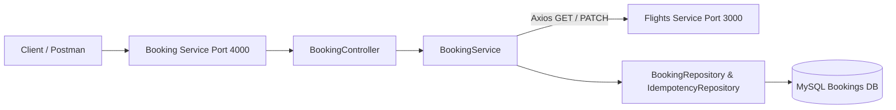

# Booking Microservice

This is the **Booking Service** microservice running on **Port 4000**, interacting synchronously with the **Flights Booking Service** (running on **Port 3000**) via HTTP requests using `axios`.

## Architecture & Layering



## Features & Booking Flow
When a booking request is made via `POST /api/v1/bookings`:
1. **Idempotency Verification**: Checks for `x-idempotency-key` header in the `IdempotencyKeys` table.
   - If the key has already completed a booking, the stored JSON result is immediately returned without charging or creating duplicate reservations.
   - If the key is currently being processed, returns `409 Conflict`.
2. **Validation**: Checks `flightId`, `userId`, and `noOfSeats`.
3. **Database Transaction Initiated**: A Sequelize database transaction begins.
4. **Flight Check**: Calls `GET http://localhost:3000/api/v1/flights/:flightId` via Axios to verify availability and retrieve pricing.
5. **Initial Record**: Inserts a booking with status `initiated`.
6. **Deduct Inventory**: Calls `PATCH http://localhost:3000/api/v1/flights/:flightId/seats` via Axios to decrement available seats on the Flights Service.
7. **Confirmation**: Updates booking status to `booked`, updates the `IdempotencyKey` record with the success response, and commits the transaction. If any failure occurs, the transaction rolls back cleanly.

## Setup Instructions

1. Navigate to the project directory:
   ```bash
   cd C:\Users\AKSHANSH RANJAN\Desktop\Code\Booking_Service
   ```

2. Install dependencies:
   ```bash
   npm install
   ```

3. Create database and run migrations:
   ```bash
   npx sequelize db:create
   npx sequelize db:migrate
   ```

4. Start the service:
   ```bash
   npm start
   ```
