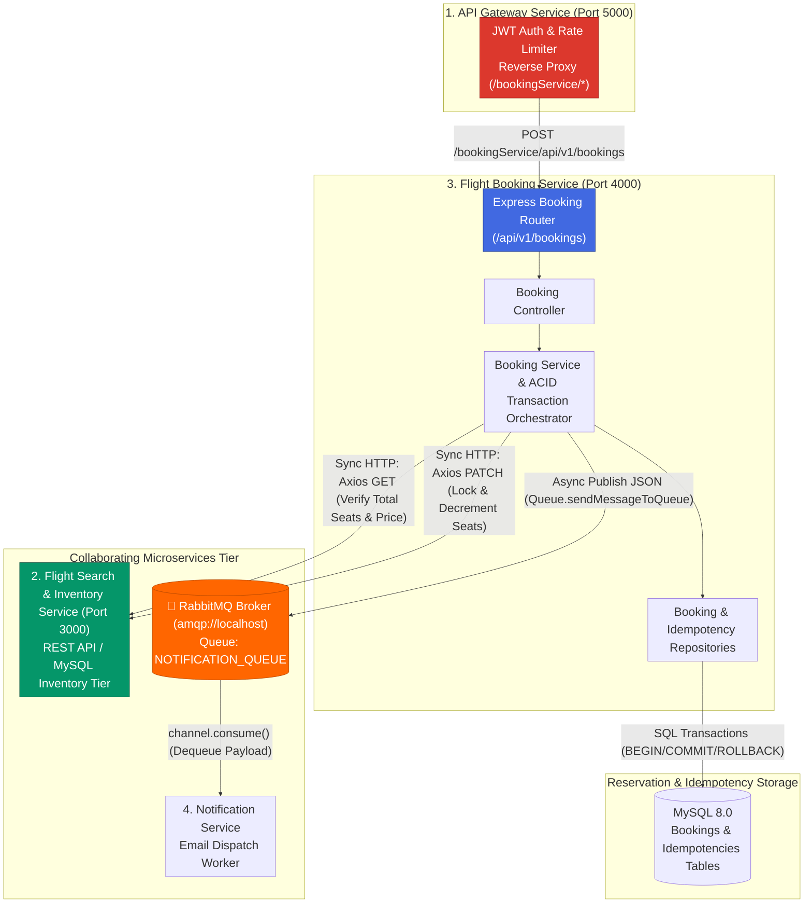

<p align="center">
  <strong>◈ SkyElite Reservation Engine</strong><br/>
  <em>ACID Transaction Controller, Payment Idempotency & Hybrid Sync/Async Booking Microservice</em>
</p>

<p align="center">
  
  
  
  
  
  
  
  
</p>

---

SkyElite Reservation Engine (`Booking_Service`) is a **production-grade reservation and transactional orchestration service** operating at the core of the distributed **SkyElite Microservices Ecosystem** (`Port 4000`). It is engineered to solve two of the hardest problems in distributed e-commerce: **preventing race-condition double bookings** and **guaranteeing duplicate-free payment processing**.

Unlike basic CRUD booking systems, SkyElite Reservation Engine executes within strict **ACID MySQL database transactions** (`sequelize.transaction()`). When a passenger initiates a booking, the service communicates **synchronously via Axios** with the Flight Inventory Tier (`Port 3000`) to verify and decrement seat counts (`PATCH /flights/:id/seats`). If any downstream failure occurs, the local transaction rolls back instantaneously (`await transaction.rollback()`), preventing orphan records.

To guarantee payment consistency, the service incorporates an **Idempotency Repository (`IdempotencyRepository`)** that checks `x-idempotency-key` request headers before processing credit charges. Once a booking status commits to `BOOKED`, the engine switches to **asynchronous event-driven communication**, publishing E-Ticket confirmation payloads directly to **RabbitMQ (`amqplib`)** where they are consumed by decoupled notification workers (`Notification-Service-Flights`) in sub-50ms checkout time.

---

## Table of Contents

- [System Architecture](#system-architecture)
- [End-to-End Pipeline](#end-to-end-pipeline)
- [What Makes This Different](#what-makes-this-different)
- [Project Structure](#project-structure)
- [Setup & Installation](#setup--installation)
- [Testing & Quality](#testing--quality)
- [API Serving](#api-serving)
- [Technical Decisions](#technical-decisions)
- [Scope & Limitations](#scope--limitations)
- [Recommended Engineering Articles](#recommended-engineering-articles)

---

## System Architecture



## End-to-End Pipeline

The booking lifecycle enforces rigid transactional state transitions (`INITIATED` ➔ `BOOKED` or `CANCELLED`):

```mermaid
flowchart LR
    A["1. Create Request<br/>`createBooking`"] --> B["2. Sync Check<br/>Axios GET Flight"]
    B --> C["3. ACID Lock<br/>Axios PATCH Decrement"]
    C --> D["4. Status INITIATED<br/>SQL Transaction Commit"]
    D --> E["5. Payment Hit<br/>Verify Idempotency Key"]
    E --> F["6. Status BOOKED<br/>Publish RabbitMQ Event"]

    style A fill:#1e1b4b,stroke:#6366f1,color:#fff
    style B fill:#312e81,stroke:#818cf8,color:#fff
    style C fill:#3730a3,stroke:#a5b4fc,color:#fff
    style D fill:#4338ca,stroke:#c7d2fe,color:#fff
    style E fill:#3b82f6,stroke:#60a5fa,color:#fff
    style F fill:#FF6600,stroke:#B34700,color:#fff
```



| Workflow | Initiator | Execution | Result |
|---|---|---|---|
| **Booking Initiation (`createBooking`)** | Client via API Gateway | Axios verification (`noOfSeats <= totalSeats`) + Axios `PATCH /seats` (`dec: true`) | Booking record created with status `INITIATED` |
| **ACID Rollback Guarantee** | Network error or Sold Out | `await transaction.rollback()` catches any Axios exception | Seat decrement reversed or cancelled; database returned to clean state |
| **Payment Idempotency (`makePayment`)** | Client with `x-idempotency-key` | `IdempotencyRepository.create` checks unique key constraint | If key exists, immediately returns cached JSON response without double-charging |
| **Async E-Ticket Dispatch** | `makePayment` transaction commit | `Queue.sendMessageToQueue(payload)` via `amqplib` | Instant checkout completion (<50ms); email sent asynchronously by Notification worker |

---

## What Makes This Different

| Concern | Typical Tutorial / CRUD Approach | SkyElite Reservation Engine |
|---|---|---|
| **Concurrency & Double Booking** | Checks seat count inside Node.js memory (`flight.seats >= req.seats`) and updates later, causing race conditions under load | Executes synchronous seat check + decrement via Axios inside an **ACID database transaction** (`sequelize.transaction()`), guaranteeing zero double bookings |
| **Payment Retry Handling** | If a user double-clicks the "Pay Now" button or network drops during checkout, credit card is charged twice | **Idempotency Keys (`IdempotencyRepository`)** enforce unique database constraints (`x-idempotency-key`); duplicate retries return cached responses safely |
| **Email Dispatch Latency** | Sends confirmation emails via SMTP inline (`nodemailer.sendMail()` awaited), causing checkout requests to block for 2-5 seconds | Hybrid design: database commits instantly, then publishes an **asynchronous JSON message to RabbitMQ (`amqplib`)**, giving passengers sub-50ms checkout responses |
| **Microservice Boundary Enforcement** | Booking database directly queries or joins `Flight_Seats` table via raw SQL cross-database joins | Strict service isolation: `Booking_Service` owns only `Bookings` and `Idempotencies` tables; all inventory actions occur via REST API (`Axios`) |
| **Cron Cancellation Workers** | Unpaid `INITIATED` bookings sit forever, tying up reserved airplane seats indefinitely | Scheduled cron jobs (`booking-cron.js`) automatically scan for stale `INITIATED` bookings > 10 minutes old, cancel them (`CANCELLED`), and release reserved seats back to `Flights_Booking_Service` |

---

## Project Structure

```
Booking_Service/
├── src/
│   ├── index.js                   # Express server startup, RabbitMQ queue connect, API route mounting
│   ├── config/
│   │   ├── server-config.js       # PORT (4000), FLIGHT_SERVICE_PATH, RABBITMQ_QUEUE_NAME
│   │   └── queue-config.js        # RabbitMQ amqplib channel assertion & message publishing helper
│   ├── controllers/
│   │   ├── index.js               # Controller exports
│   │   ├── booking-controller.js  # createBooking, makePayment endpoints
│   │   └── info-controller.js     # Health monitoring (`GET /api/v1/info`)
│   ├── models/
│   │   ├── index.js               # Sequelize database connection factory
│   │   ├── booking.js             # Booking schema (flightId, userId, status, noOfSeats, totalCost)
│   │   └── idempotency.js         # Idempotency key schema (key, response, createdAt)
│   ├── repositories/
│   │   ├── booking-repository.js  # ACID transaction abstractions (`bookingRepository.create(data, { transaction })`)
│   │   └── idempotency-repository.js # Idempotency key persistence & lookup
│   ├── services/
│   │   └── booking-service.js     # Core transaction logic: Axios seat sync, Idempotency checks, RabbitMQ publish
│   ├── routes/
│   │   ├── index.js               # Router root (`/api`)
│   │   └── v1/
│   │       ├── index.js           # API v1 router (`/bookings`, `/info`)
│   │       └── booking-routes.js  # Booking initiation & payment route definitions
│   └── utils/
│       ├── errors/                # AppError, ServiceError exception hierarchies
│       └── cron/
│           └── booking-cron.js    # Stale booking cleanup cron job (`node-cron`)
├── migrations/                    # Sequelize migrations for Bookings & Idempotency tables
├── package.json                   # Dependencies: express, axios, sequelize, mysql2, amqplib, node-cron
└── README.md                      # Complete architectural documentation
```

---

## Setup & Installation

### Prerequisites
- **Node.js 20+**
- **MySQL 8.0+** running on `127.0.0.1:3306`
- **RabbitMQ Broker** running locally on `amqp://localhost` (via Docker: `docker run -d --name rabbitmq -p 5672:5672 rabbitmq`)

### Step-by-Step

```powershell
# 1. Clone the repository
git clone https://github.com/Akshansh0519/Airline_Reservation_Service.git
cd Airline_Reservation_Service

# 2. Configure Environment (.env)
echo PORT=4000 > .env
echo FLIGHT_SERVICE_PATH=http://localhost:3000 >> .env
echo RABBITMQ_QUEUE_NAME=NOTIFICATION_QUEUE >> .env

# 3. Install dependencies and initialize database
npm install
npx sequelize db:create
npx sequelize db:migrate

# 4. Start the Booking Service Server (Terminal 3)
npm start
```

---

## How to RUN the Complete Microservice Ecosystem

Ensure MySQL and RabbitMQ (`amqp://localhost`) are running locally before starting the services. All 4 microservices work together and are reverse-proxied by the central **API Gateway Service** (Port `5000`) with JWT Authentication and Rate Limiting (`express-rate-limit`).

```bash
# Terminal 1 — API Gateway Service (Port 5000) [Central Entry Point & JWT Auth]
cd "D:\TO DO THINGS\Developer\Api_gateway_flights"
npm start

# Terminal 2 — Flight Search & Inventory Service (Port 3000)
cd "D:\TO DO THINGS\Developer\Flights_Booking_Service"
npm start

# Terminal 3 — Flight Booking Service (Port 4000) [ACID Transactions & Axios Sync]
cd "D:\TO DO THINGS\Developer\Booking_Service"
npm start

# Terminal 4 — Notification Service [RabbitMQ Async Worker & Nodemailer]
cd "D:\TO DO THINGS\Developer\Notification-Service-Flights"
npm start

# Terminal 5 — Next.js Frontend Web Application (Proxied directly via Port 5000)
cd "D:\TO DO THINGS\Developer\Flights_Booking_Service\frontend"
npm run dev
```

### 🔗 Architectural Verification & Wiring
- **All Frontend API Requests (`/api/v1/*`)** are routed directly through `http://localhost:5000` (API Gateway).
- **JWT Authentication (`/api/v1/user/signup` & `/signin`)** is handled centrally by `Api_gateway_flights` (`auth-middleware.js`).
- **Sync Communication (Axios REST):** When booking seats via Gateway (`/bookingService/api/v1/bookings`), `Booking_Service` (`Port 4000`) synchronously verifies and locks seats from `Flights_Booking_Service` (`Port 3000`).
- **Async Communication (RabbitMQ):** When a payment commits, `Booking_Service` publishes a confirmation event to `RabbitMQ`, which `Notification-Service-Flights` consumes to send HTML E-Tickets via Nodemailer.
- For a deep dive into how Axios and RabbitMQ connect our microservices, read **[MICROSERVICES_COMMUNICATION_GUIDE.md](../Flights_Booking_Service/MICROSERVICES_COMMUNICATION_GUIDE.md)**.

---

## Testing & Quality

To verify ACID transaction boundaries and queue publishing reliability, inspect the core business logic using static checks:

```powershell
# Verify all seat modifications occur inside explicit database transactions
grep -rn "transaction:" src/

# Verify Idempotency Repository checks header keys before executing payments
grep -rn "IdempotencyRepository" src/

# Verify RabbitMQ publishing uses durable amqplib queue assertions
grep -rn "sendMessageToQueue" src/
```

---

## API Serving

### Reservation & Payment Endpoints (`Port 4000` / Proxied via Gateway `/bookingService`)
| Method | Endpoint | Required Headers | Payload | Description |
|---|---|---|---|---|
| `POST` | `/api/v1/bookings` | `x-idempotency-key`, `x-access-token` | `{ flightId: 1, noOfSeats: 2 }` | Initiates reservation (`INITIATED`), checks & locks seats in Flight Service |
| `POST` | `/api/v1/bookings/payments` | `x-idempotency-key`, `x-access-token` | `{ bookingId: 1, totalCost: 9000 }` | Verifies idempotency, updates status to `BOOKED`, pushes RabbitMQ event |
| `GET` | `/api/v1/info` | `x-access-token` | — | Service health and alive monitoring check |

---

## Technical Decisions

| Decision | Rationale |
|---|---|
| **ACID Database Transactions (`sequelize.transaction`)** | Booking flights involves multi-step operations (`Axios verification`, `Axios seat decrement`, `Booking record creation`). Wrapping these steps inside an explicit MySQL transaction guarantees **atomic rollback** (`transaction.rollback()`) if any step fails. |
| **Idempotency Keys (`x-idempotency-key`)** | Network timeouts often cause users to hit the submit button twice. By persisting the unique client key inside an `Idempotencies` MySQL table, duplicate requests immediately trigger a conflict check and return the exact stored response without re-charging. |
| **Hybrid Sync/Async Architecture** | Reserving inventory requires **Synchronous REST (`Axios`)** because seat availability cannot be eventually consistent. But sending E-Tickets is **Asynchronous (`RabbitMQ`)** because email delivery latency (2-5s) should never slow down the passenger checkout experience (<50ms). |
| **Node-Cron Stale Cleanup** | Unpaid `INITIATED` bookings hold seats hostage. Running a lightweight local worker (`node-cron`) every 10 minutes ensures abandoned checkout carts release inventory back to the Flight Search tier automatically. |

---

## Scope & Limitations

> **Transparency note:** This service is built to demonstrate ACID transactional patterns in distributed flight reservations.

- **Payment Gateway Mocking:** Currently checks `req.body.totalCost >= booking.totalCost` and marks the booking `BOOKED`. Production e-commerce deployments would integrate Stripe or Razorpay webhook verification (`checkout.session.completed`) inside `makePayment`.
- **Distributed Locking:** Uses single-instance MySQL transactions. For ultra-high concurrency flash sales across distributed database shards, implementing a **Redis Distributed Lock (Redlock)** around `flightId` would prevent database lock contention.
- **Outbox Pattern:** Currently publishes to RabbitMQ directly inside `makePayment`. Implementing the **Transactional Outbox Pattern** (`Outbox_Events` table) would guarantee 100% message delivery even if RabbitMQ temporarily drops connection during transaction commit.

---

## Recommended Engineering Articles

1. ⭐⭐⭐ **Designing Idempotent APIs**
   [Idempotency in API Design: How Stripe Prevents Duplicate Charges (Stripe Engineering)](https://stripe.com/blog/idempotency)
2. ⭐⭐⭐ **ACID Transactions vs Eventual Consistency**
   [Distributed Transactions & The Saga Pattern in Microservices (Chris Richardson)](https://microservices.io/patterns/data/saga.html)
3. ⭐⭐⭐ **Reliable Messaging & The Outbox Pattern**
   [Transactional Outbox Pattern for Microservices Messaging](https://microservices.io/patterns/data/transactional-outbox.html)
4. ⭐⭐ **RabbitMQ vs Kafka for Event-Driven Microservices**
   [When to use RabbitMQ AMQP vs Apache Kafka in Distributed Architectures](https://www.confluent.io/learn/kafka-vs-rabbitmq/)
5. ⭐⭐⭐ **Handling Race Conditions in SQL ORMs**
   [Sequelize Transaction Isolation Levels and Lock Management](https://sequelize.org/docs/v6/other-topics/transactions/)

---

<p align="center">
  Built with intention by <strong>Akshansh Ranjan</strong>
</p>
